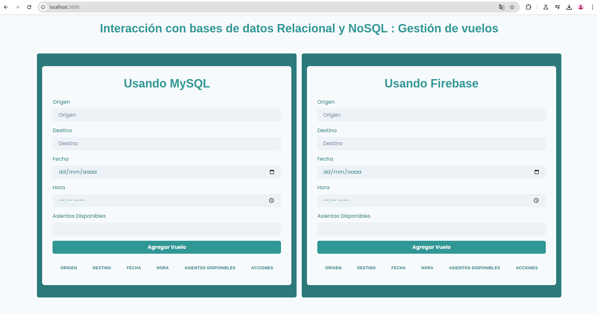
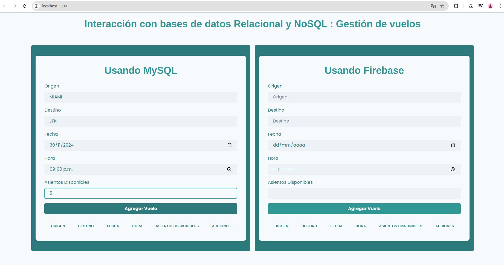
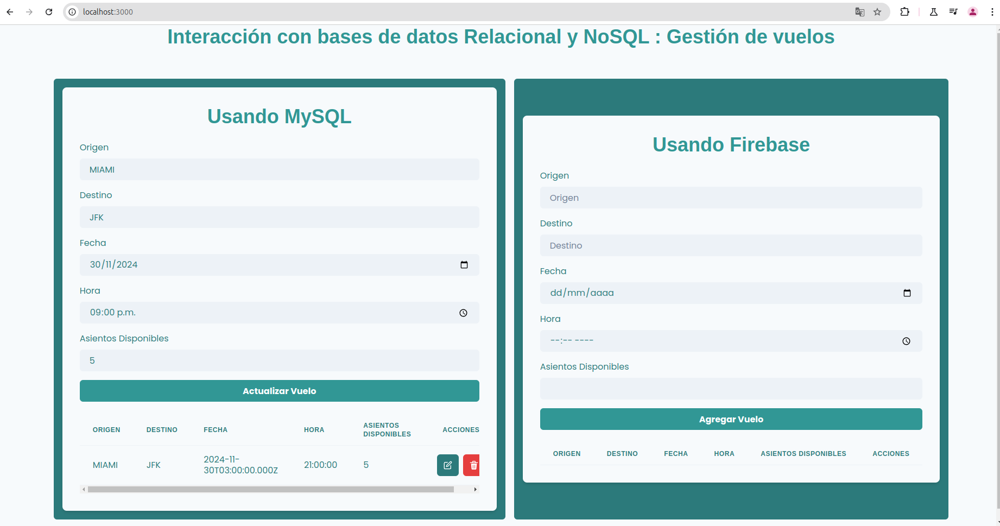
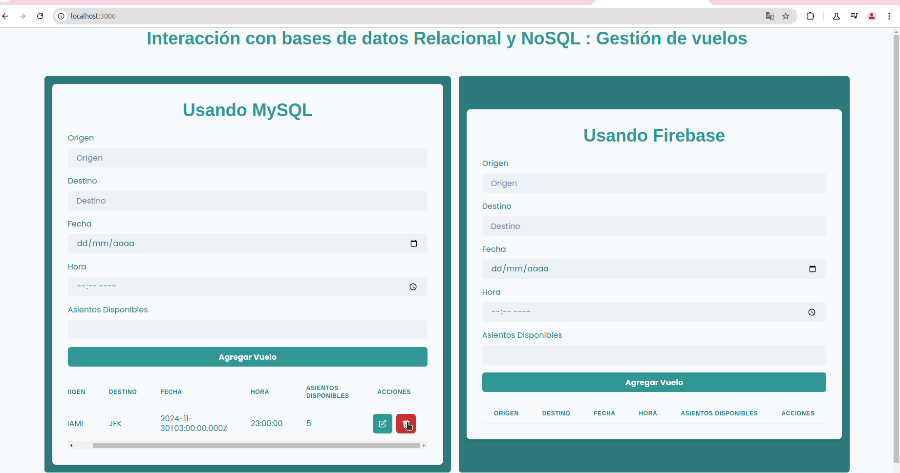

# **Informe Final del Trabajo Práctico**

Para este trabajo práctico, desarrollamos una aplicación web destinada a explorar las diferencias prácticas entre bases de datos relacionales y NoSQL. A través de una interfaz intuitiva, implementamos operaciones CRUD (crear, leer, actualizar y eliminar) que interactúan tanto con una base de datos MySQL como con Firebase. A continuación, detallamos nuestro enfoque, decisiones tecnológicas y aprendizajes.

Desde el inicio, optamos por React como la base para el desarrollo del frontend. Elegimos esta biblioteca debido a su capacidad para construir interfaces dinámicas y su amplio soporte en la comunidad. Además, utilizamos Chakra UI, que nos permitió diseñar rápidamente componentes visuales modernos y accesibles. El lenguaje JavaScript facilitó mantener un equilibrio entre el frontend y el backend, mejorando la coherencia del proyecto.

En el backend, empleamos Node.js, aprovechando su soporte nativo para asincronismo y la flexibilidad de su ecosistema de librerías. Creamos una API REST que gestionó la lógica de negocio y las conexiones a las bases de datos. Para la base de datos relacional, utilizamos MySQL, aprovechando un servidor remoto gratuito de FreeSQLDataBase. Aunque el espacio estaba limitado a 5 MB, fue suficiente para cubrir las necesidades del trabajo. Por otro lado, Firebase fue la elección para la base de datos NoSQL. Esta plataforma no solo simplificó la configuración, sino que también nos permitió manejar datos menos estructurados con facilidad.

Durante el desarrollo, implementamos operaciones CRUD en ambas bases. Para MySQL, utilizamos consultas tradicionales (`INSERT`, `SELECT`, `UPDATE` y `DELETE`), mientras que en Firebase empleamos métodos como `add`, `get`, `update` y `delete`. Esto nos permitió identificar diferencias clave: mientras que MySQL requiere una estructura rígida y esquemas bien definidos, Firebase ofrece mayor flexibilidad, lo que facilita adaptarse a cambios en la estructura de datos. Sin embargo, esta flexibilidad puede derivar en redundancias si no se diseña adecuadamente.

### **Interfaz de Usuario y Experiencia**

La aplicación está diseñada para ofrecer una experiencia clara e intuitiva. En la interfaz principal, se muestran dos módulos: uno para MySQL y otro para Firebase, cada uno con sus propios formularios y tablas. Cada formulario incluye los siguientes campos: **origen**, **destino**, **fecha**, **hora** y **asientos disponibles**, necesarios para registrar un vuelo. Una vez ingresada la información, esta se envía al backend y se almacena en la base de datos correspondiente.

En la parte inferior de cada módulo, las tablas muestran los vuelos registrados, con funcionalidades para editar o eliminar registros directamente desde la interfaz. La disposición visual permite que el usuario interactúe simultáneamente con ambas bases de datos, facilitando la comparación en tiempo real de su comportamiento.

La captura de la interfaz ilustra cómo se organizaron los elementos visuales para garantizar la claridad del flujo de interacción:

A continuación vamos a mostrar visualmente las operaciones CRUD que se pueden realizar

## Crear un registro de un vuelo y mostrarlo

Para ver que funciona correctamente la operacion de crear un vuelo vamos a ingresar un vuelo en la base de datos relacional, llenando los campos necesarios en el formulario correspondiente

Luego de apretar el botón **Agregar Vuelo** se puede observar que se ingresó correctamente el vuelo, y lo podemos visualizar en la tabla que está por debajo de dicho botón

## Actualizar un registro de un vuelo

Si quisieramos actualizar un registro de un vuelo, la interfaz es bantante intuitiva, bastaria con apretar el botón verde que está al lado del registro que queremos modificar y nos desplegaría el mismo formulario pero con el botón **Actualizar**. A fines didácticos, modificaremos el vuelo ingresado anteriormente, luego de apretar el botón de modificar.

Luego de apretar el dicho botón podemos observar como tenemos la posibilidad de modificar el formulario que corresponde al vuelo registrado, en nuestro caso queremos modificar la hora de salida de dicho vuelo. Luego de modificar la hora y apretando el botón **Actualizar Vuelo**

Vemos que efectivamente se actualizó la hora del vuelo.

## Borrar un registro de un vuelo

Si por algún motivo necesitamos eliminar un registro de un vuelo, simplemente con apretar el botón rojo se elimina

Todas estas operaciones, también se pueden realizar ingresando los datos en el formulario de Firebase.

### **Funcionalidad y Comparación Práctica**

El sistema ofrece una visión clara de cómo funcionan las bases de datos relacionales frente a las NoSQL:

- **MySQL**: Con su estructura estricta y normalizada, es ideal para aplicaciones que requieren consistencia, como la gestión de vuelos en aeropuertos. Proporciona un modelo relacional que garantiza integridad referencial y permite consultas complejas.
- **Firebase**: Gracias a su esquema flexible, destaca en aplicaciones donde los datos pueden variar con frecuencia o carecen de una estructura fija. Esto resulta útil para manejar escenarios más dinámicos.

La aplicación muestra estas diferencias en tiempo real, permitiendo realizar las mismas operaciones en ambas bases de datos y comparar sus tiempos de respuesta, capacidades de manejo de datos y comportamientos generales.

### **Retos y Aprendizajes**

Entre las dificultades enfrentadas, destacamos la integración inicial entre el frontend y el backend. Además, trabajar con un servidor remoto de MySQL implicó ajustar las consultas para optimizar el uso del espacio limitado. Un desafío importante que se presentó en MySQL es lo vulnerable que está el backend   ante un ataque de seguridad, ya que los credenciales al servidor estan expuestas, tuvimos que usar un archivo .env para almacenar variables de entorno en un formato de texto plano.
Con la idea de separar las configuraciones fuera del código fuente, evitamos  exponer información sensible. Sólo en este caso especial incluimos en el repositorio publico el archivo .env a fines de mostrar cómo se hizo. Si embargo, la buena práctica es poner el archivo .env en .gitignore cosa de que git no lo suba al repositorio y las credenciales permanecen privadas Por otro lado, Firebase nos desafió a mantener la estructura de los datos clara y sin redundancias, aprovechando su flexibilidad sin caer en desorden.

El desarrollo del proyecto presentó algunos desafíos interesantes, como la configuración simultánea de dos bases de datos distintas y la sincronización de sus respuestas en la interfaz. Por ejemplo, mientras MySQL requería definiciones explícitas de relaciones y tipos de datos, Firebase permitía manejar datos con mayor flexibilidad, pero demandaba validaciones adicionales para asegurar consistencia.

Esta experiencia subrayó las ventajas de cada tecnología en diferentes contextos. **MySQL** resultó ideal para mantener estructuras rígidas y relaciones complejas, mientras que **Firebase** demostró su eficacia al manejar datos no estructurados y procesos más ágiles.

### **Conclusión**

En resumen, este trabajo práctico nos permitió profundizar en el uso de bases de datos relacionales y NoSQL, entendiendo sus diferencias y aplicaciones prácticas. También mejoramos nuestra capacidad para diseñar e implementar un sistema completo, desde la interfaz de usuario hasta la conexión con múltiples bases de datos. El aprendizaje obtenido no solo fortaleció nuestras habilidades técnicas, sino que también nos brindó una perspectiva más amplia sobre cómo elegir tecnologías según las necesidades específicas de un proyecto.
